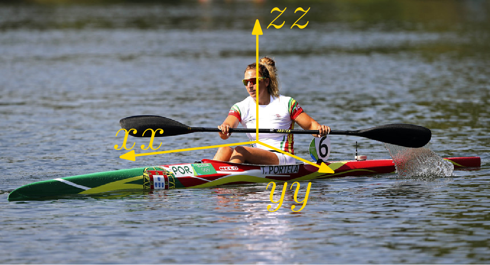
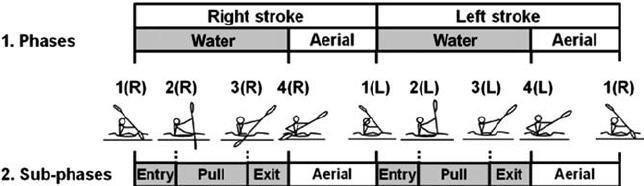
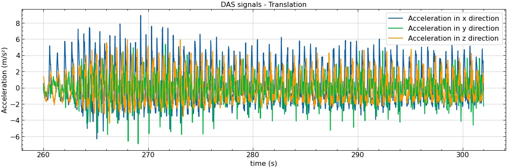
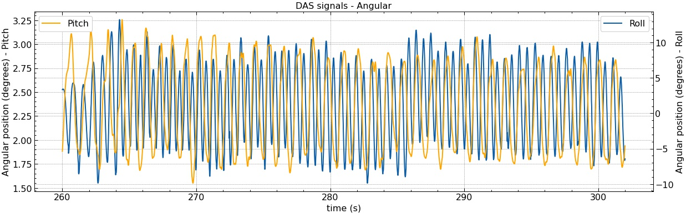
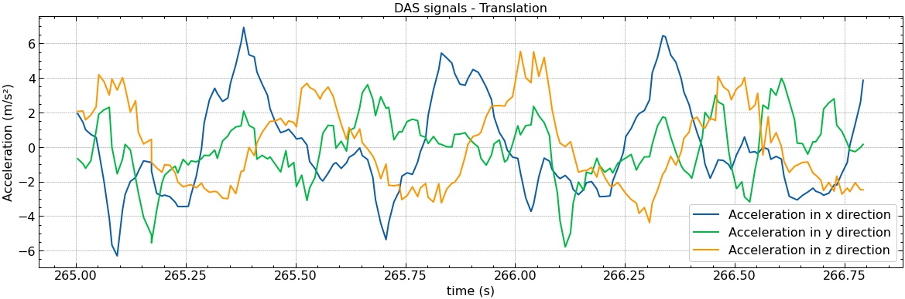
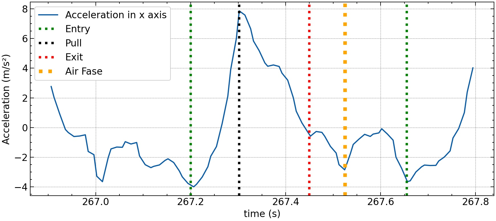
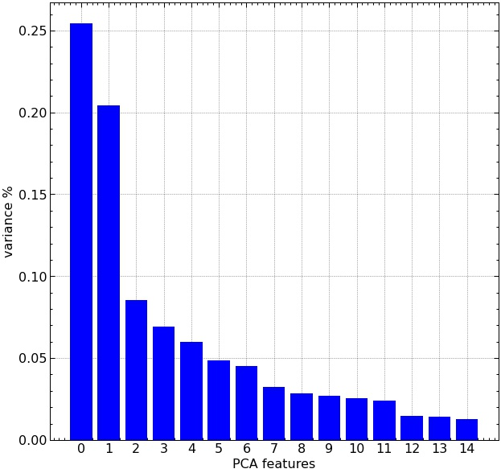
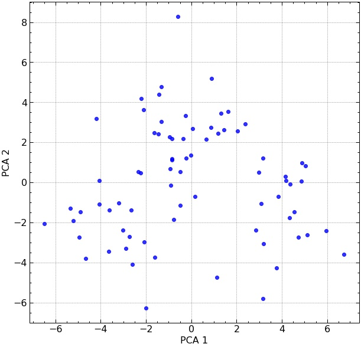
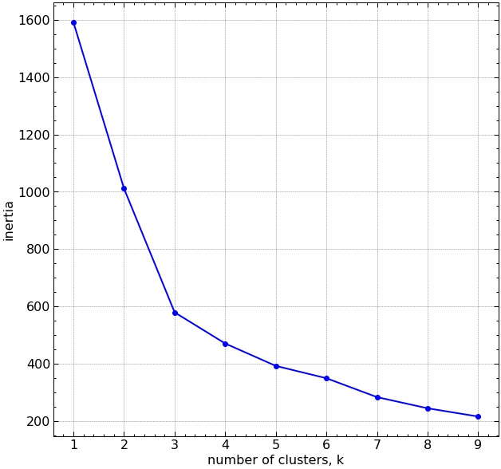
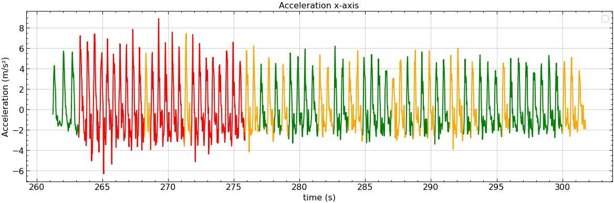

One of the most important challenges in the competitive Kayaks production industry is figuring out whether a new model performs better and where it can be improved. This task is not trivial, as it is not always clear how to measure performance as well as ensure that tests are performed under similar conditions.

Ideally, the metric that best represents boat performance is speed, but it is not always possible to guarantee similar conditions between tests, as there are many variables to consider - for example, water current, wind direction and speed, and athlete’s performance.

If the environmental variables are easy to verify, the athlete’s performance proves to be an arduous task. Thus, a systematic method of evaluating the athlete’s performance is imperative.

To mitigate this problem a form of classification of the athlete’s strokes was developed. In this way, it is possible to verify if in a series (exercise), there was a similar number of good strokes.

For this task, we used a data acquisition system (DAS) consisting of an inertial sensor (IMU) and a web server, plus an Android application, which allows recording and synchronizing video frames with DAS data.

After data collection, a data sets meeting the following requirements was chosen.

* Best Environmental conditions
* Best speed

### Roadmap

1. Find starting point of the stroke
2. Divide Stroke into its various phases
3. Calculate indicators for eche phases
4. Classify strokes groups based on its indicators

# Stroke Phases Division

"Canoe paddle strokes are the means by which a paddle (or paddles) is used to move a canoe through the water.";

For this study, it is important to divide the stroke into its various components or phases.

From observing the movement of the boat-paddle-athlete system, we can split the different phases according to the picture below:

The gathered signals are similar to this.

Making zoom in accelerations signals.

We can see that there are 3 strokes (3 peaks), considering that the loss of acceleration is maximum at the exact moment before the paddle enters the water, we can say that the phase in the water starts at this point and lasts until the first negative peak entering areal phase.

The entry lasts until the maximum acceleration point, then entering the pull phase, which lasts until the acceleration is negative, entering the exit phase.

So, now we have to calculate de indicators for each stroke phase. The indicators are calculated based on angular position and acceleration signals and are:

* Speed Variation
* Mean Pitch
* Pitch Amplitude
* Mean Acceleration
* Min Acceleration
* Max Acceleration
* Useful Force

After processing the data, we obtain a data frame with 75 strokes and 39 indicators.

|     | name                            | type    | null | unique |
| --- | ------------------------------- | ------- | ---- | ------ |
| 0   | Speed Variation - Entry Phase   | float64 | 0    | 75     |
| 1   | Pitch Amplitude - Entry Phase   | float64 | 0    | 75     |
| 2   | Mean Acceleration - Entry Phase | float64 | 0    | 75     |
| 3   | Min Acceleration - Entry Phase  | float64 | 0    | 75     |
| 4   | Max Acceleration - Entry Phase  | float64 | 0    | 75     |
| 5   | Mean Pitch - Entry Phase        | float64 | 0    | 75     |
| 6   | Useful Force - Entry Phase      | float64 | 0    | 75     |
| 7   | Speed Variation - Pull Phase    | float64 | 0    | 75     |
| 8   | Pitch Amplitude - Pull Phase    | float64 | 0    | 75     |
| 9   | Mean Acceleration - Pull Phase  | float64 | 0    | 75     |
| 10  | Min Acceleration - Pull Phase   | float64 | 0    | 75     |
| 11  | Max Acceleration - Pull Phase   | float64 | 0    | 75     |
| 12  | Mean Pitch - Pull Phase         | float64 | 0    | 75     |
| 13  | Useful Force - Pull Phase       | float64 | 0    | 75     |
| 14  | Speed Variation - Exit Phase    | float64 | 0    | 75     |
| 15  | Pitch Amplitude - Exit Phase    | float64 | 0    | 75     |
| 16  | Mean Acceleration - Exit Phase  | float64 | 0    | 75     |
| 17  | Min Acceleration - Exit Phase   | float64 | 0    | 75     |
| 18  | Max Acceleration - Exit Phase   | float64 | 0    | 75     |
| 19  | Mean Pitch - Exit Phase         | float64 | 0    | 75     |
| 20  | Useful Force - Exit Phase       | float64 | 0    | 75     |
| 21  | Speed Variation - Air Phase     | float64 | 0    | 75     |
| 22  | Pitch Amplitude - Air Phase     | float64 | 0    | 75     |
| 23  | Mean Acceleration - Air Phase   | float64 | 0    | 75     |
| 24  | Min Acceleration - Air Phase    | float64 | 0    | 75     |
| 25  | Max Acceleration - Air Phase    | float64 | 0    | 75     |
| 26  | Mean Pitch - Air Phase          | float64 | 0    | 75     |
| 27  | Useful Force - Air Phase        | float64 | 0    | 75     |
| 28  | Speed Variation - Water Phase   | float64 | 0    | 75     |
| 29  | Pitch Amplitude - Water Phase   | float64 | 0    | 75     |
| 30  | Mean Acceleration - Water Phase | float64 | 0    | 75     |
| 31  | Min Acceleration - Water Phase  | float64 | 0    | 75     |
| 32  | Max Acceleration - Water Phase  | float64 | 0    | 75     |
| 33  | Mean Pitch - Water Phase        | float64 | 0    | 75     |
| 34  | Useful Force - Water Phase      | float64 | 0    | 75     |
| 35  | Water Time                      | float64 | 0    | 75     |
| 36  | Air Time                        | float64 | 0    | 75     |
| 37  | Stroke Rate                     | float64 | 0    | 75     |
| 38  | Stroke Time                     | float64 | 0    | 75     |

Now, we have to group the strokes to find the class that they belong.
As shown in the table above, this new data frame has several dimensions, so it is impossible to clearly visualize each of the clusters.
Therefore, we will proceed to a dimension reduction by using Principal Compoment Analysis(PCA)
For this, we first normalize the data by preserving its variance, then draw the explained variance ratio  from the PCA.

In the plot we see that the major drop happens from 1 to 2 features, so we will use the first 2 features of PCA to plot the date.

The plot appears to have 3 data clusters, but for a more rigorous approach we will use the elbow method to find the right number of clusters.

For that we'll use KMEANS, witch acording to scikit-learn page is cluster algorithm  that "clusters data by trying to separate samples in n groups of equal variance, minimizing a criterion known as the *inertia* or within-cluster sum-of-squares. This algorithm requires the number of clusters to be specified. It scales well to large number of samples and has been used across a large range of application areas in many different fields."

This algorithm is suited to this problem, because it does not depend on previous label data.

As shown in above plot the ideal number of clusters is 3, like being though before.

Now that we have the number of clusters, we'll classify every stroke in the data series.

With this procedure, we have a robust method for classifying the athlete stroke and with it we can compare the performance in different boats in a similar manner