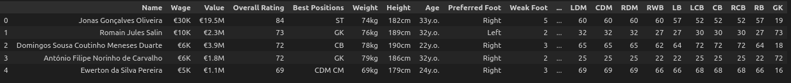
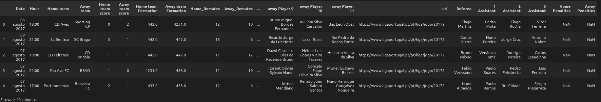

## Project architecture

## 1. Buil dataset

Para criar o dataset adquado para o objectivo recolhi dados da web sobre os jogos, jogares e odds das principais casas de apostas e fundios num dataset

### 1.1 Scrape Data

#### 1.1.1 Players data

Um bom site com dados de jogadores de futebol é o [sofifa.com](https://sofifa.com).
Depois de examinar o site não encontrei nenhuma api com os dados de interesse, por isso usei scrapy, que é um framework the python para webscraping.
Apos o scrape fiquei com um dataset da seguinte forma:



|    | name                     | type   |   null |   unique |
|---:|:-------------------------|:-------|-------:|---------:|
|  0 | Name                     | object |      0 |      476 |
|  1 | Wage                     | object |      0 |       14 |
|  2 | Value                    | object |      0 |      106 |
|  3 | Overall Rating           | int64  |      0 |       26 |
|  4 | Best Positions           | object |      0 |       81 |
|  5 | Weight                   | object |      0 |       38 |
|  6 | Height                   | object |      0 |       35 |
|  7 | Age                      | object |      0 |       20 |
|  8 | Preferred Foot           | object |      0 |        2 |
|  9 | Weak Foot                | int64  |      0 |        5 |
| 10 | Skill Moves              | int64  |      0 |        5 |
| 11 | International Reputation | int64  |      0 |        4 |
| 12 | Work Rate                | object |      0 |        8 |
| 13 | Body Type                | object |      0 |        9 |
| 14 | Joined                   | object |      0 |      167 |
| 15 | Contract Valid Until     | object |      0 |        8 |
| 16 | Crossing                 | int64  |      0 |       74 |
| 17 | Finishing                | int64  |      0 |       75 |
| 18 | Heading Accuracy         | int64  |      0 |       68 |
| 19 | Short Passing            | int64  |      0 |       62 |
| 20 | Volleys                  | int64  |      0 |       79 |
| 21 | Dribbling                | int64  |      0 |       73 |
| 22 | Curve                    | int64  |      0 |       76 |
| 23 | FK Accuracy              | int64  |      0 |       72 |
| 24 | Long Passing             | int64  |      0 |       69 |
| 25 | Ball Control             | int64  |      0 |       67 |
| 26 | Acceleration             | int64  |      0 |       72 |
| 27 | Sprint Speed             | int64  |      0 |       71 |
| 28 | Agility                  | int64  |      0 |       67 |
| 29 | Reactions                | int64  |      0 |       38 |
| 30 | Balance                  | int64  |      0 |       69 |
| 31 | Shot Power               | int64  |      0 |       73 |
| 32 | Jumping                  | int64  |      0 |       59 |
| 33 | Stamina                  | int64  |      0 |       72 |
| 34 | Strength                 | int64  |      0 |       62 |
| 35 | Long Shots               | int64  |      0 |       80 |
| 36 | Aggression               | int64  |      0 |       76 |
| 37 | Interceptions            | int64  |      0 |       78 |
| 38 | Positioning              | int64  |      0 |       80 |
| 39 | Vision                   | int64  |      0 |       65 |
| 40 | Penalties                | int64  |      0 |       73 |
| 41 | Marking                  | int64  |      0 |       76 |
| 42 | Standing Tackle          | int64  |      0 |       73 |
| 43 | Sliding Tackle           | int64  |      0 |       72 |
| 44 | GK Diving                | int64  |      0 |       38 |
| 45 | GK Handling              | int64  |      0 |       34 |
| 46 | GK Kicking               | int64  |      0 |       36 |
| 47 | GK Positioning           | int64  |      0 |       36 |
| 48 | GK Reflexes              | int64  |      0 |       39 |
| 49 | Traits                   | object |      0 |      136 |
| 50 | LS                       | int64  |      0 |       57 |
| 51 | ST                       | int64  |      0 |       57 |
| 52 | RS                       | int64  |      0 |       57 |
| 53 | LW                       | int64  |      0 |       66 |
| 54 | LF                       | int64  |      0 |       62 |
| 55 | CF                       | int64  |      0 |       62 |
| 56 | RF                       | int64  |      0 |       62 |
| 57 | RW                       | int64  |      0 |       66 |
| 58 | LAM                      | int64  |      0 |       61 |
| 59 | CAM                      | int64  |      0 |       61 |
| 60 | RAM                      | int64  |      0 |       61 |
| 61 | LM                       | int64  |      0 |       61 |
| 62 | LCM                      | int64  |      0 |       58 |
| 63 | CM                       | int64  |      0 |       58 |
| 64 | RCM                      | int64  |      0 |       58 |
| 65 | RM                       | int64  |      0 |       61 |
| 66 | LWB                      | int64  |      0 |       58 |
| 67 | LDM                      | int64  |      0 |       58 |
| 68 | CDM                      | int64  |      0 |       58 |
| 69 | RDM                      | int64  |      0 |       58 |
| 70 | RWB                      | int64  |      0 |       58 |
| 71 | LB                       | int64  |      0 |       60 |
| 72 | LCB                      | int64  |      0 |       62 |
| 73 | CB                       | int64  |      0 |       62 |
| 74 | RCB                      | int64  |      0 |       62 |
| 75 | RB                       | int64  |      0 |       60 |
| 76 | GK                       | int64  |      0 |       34 |


O dataset é composto por 77 colunas e 476 linhas, correspondento a 77 atributos de 476 jogadores.

#### 1.1.2 Portuguese League Games

Ao inspecionar o site oficial da liga portuguesa encontrei um endpoint que retorna os dados do jogo.

```
"https://www.ligaportugal.pt/pt/liga/jogo/{league_edition}/1/{week}/{match_number}/resumo/true"
```

Assim construi um dataset com os dados de todos os jogos da liga.



|    | name                   | type    |   null |   unique |
|---:|:-----------------------|:--------|-------:|---------:|
|  0 | Date                   | object  |      0 |      131 |
|  1 | Hour                   | object  |      0 |       13 |
|  2 | Home team              | object  |      0 |       18 |
|  3 | Away team              | object  |      0 |       18 |
|  4 | Home team score        | int64   |      0 |        7 |
|  5 | Away team score        | int64   |      0 |        7 |
|  6 | Home team Formation    | float64 |     15 |        5 |
|  7 | Away team Formation    | float64 |     15 |        6 |
|  8 | Home_Remates           | int64   |      0 |       25 |
|  9 | Away_Remates           | int64   |      0 |       24 |
| 10 | Home_Posse de Bola     | int64   |      0 |       41 |
| 11 | Away_Posse de Bola     | int64   |      0 |       41 |
| 12 | Home_Faltas Cometidas  | int64   |      0 |       24 |
| 13 | Away_Faltas Cometidas  | int64   |      0 |       24 |
| 14 | Home_Cantos            | int64   |      0 |       16 |
| 15 | Away_Cantos            | int64   |      0 |       17 |
| 16 | Home_Cartões Amarelos  | int64   |      0 |        8 |
| 17 | Away_Cartões Amarelos  | int64   |      0 |        8 |
| 18 | Home_Cartões Vermelhos | int64   |      0 |        3 |
| 19 | Away_Cartões Vermelhos | int64   |      0 |        3 |
| 20 | home Player 1          | object  |     15 |      197 |
| 21 | home Player 2          | object  |     15 |      203 |
| 22 | home Player 3          | object  |     15 |      198 |
| 23 | home Player 4          | object  |     15 |      199 |
| 24 | home Player 5          | object  |     15 |      200 |
| 25 | home Player 6          | object  |     15 |      190 |
| 26 | home Player 7          | object  |     15 |      200 |
| 27 | home Player 8          | object  |     15 |      201 |
| 28 | home Player 9          | object  |     15 |      211 |
| 29 | home Player 10         | object  |     15 |      200 |
| 30 | home Player 11         | object  |     15 |      207 |
| 31 | away Player 1          | object  |     15 |      208 |
| 32 | away Player 2          | object  |     15 |      194 |
| 33 | away Player 3          | object  |     15 |      202 |
| 34 | away Player 4          | object  |     15 |      197 |
| 35 | away Player 5          | object  |     15 |      195 |
| 36 | away Player 6          | object  |     15 |      213 |
| 37 | away Player 7          | object  |     15 |      212 |
| 38 | away Player 8          | object  |     15 |      201 |
| 39 | away Player 9          | object  |     15 |      195 |
| 40 | away Player 10         | object  |     15 |      188 |
| 41 | away Player 11         | object  |     15 |      200 |
| 42 | url                    | object  |      0 |      306 |
| 43 | Referee                | object  |      0 |       22 |
| 44 | 1 Assistant            | object  |      0 |       38 |
| 45 | 2 Assistant            | object  |      0 |       39 |
| 46 | 3 Assistant            | object  |      0 |       84 |
| 47 | Home Penalties         | float64 |    306 |        0 |
| 48 | Away Penalties         | float64 |    306 |        0 |

#### 1.1.3 Portuguese Leagues Games Odds

dsgdfgdgdfgdd

### 1.2 Clean data

asdasdasd sdfsdf

#### 1.2.1 Clean SOFIFA Players data

fssdfjjj fdsdf lkjsd

#### 1.2.2 Clean Portuguese League Games data

dsdssdf sddggdfg

#### 1.2.3 Clean Portuguese Leagues Games Odds data

asdasdas gdgdfgdf

### 1.3 Merge data

asdasda sdfsdfsdf
dsfsdf